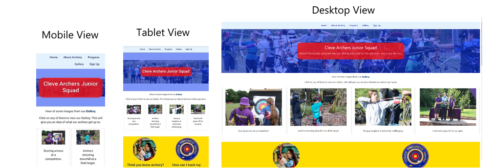

<div align="center">
  
</div>

[The Cleve Archers Junior Squad](https://blockhead77.github.io/flightpath/index.html)  website has been created to be an informative site. Showcasing the existing club's efforts, informing new viewers of what to expect and inviting those viewers to partake in a taster session or beginners course. As the site has been design to appeal to our juniors and new junior members alike, I created lots of clickable content to keep them entertained. I used the primary colors as found on most archery targets to give the site a familiar archery feel.

## Table of Contents
1. <details open>
    <summary><a href="#user-experience">User Experience</a></summary>

    <ul>
    <li>
    <details>
    <summary><a href="#goals">Goals</a></summary>

    - [Visitor Goals](#visitor-goals)
    - [Business Goals](#business-goals)
    - [User Stories](#user-stories)
    </details></li>

    <li><details>
    <summary><a href="#visual-design">Visual Design</a></summary>

    - [Wireframes](#wireframes)
    - [Fonts](#fonts)
    - [Icons](#icons)
    - [Colors](#colors)
    - [Styling](#styling)
    </details></li>
    </ul>
</details>

2. <details open>
    <summary><a href="#features">Features</a></summary>

    <ul>
    <li><details>
    <summary><a href="#page-elements">Page Elements</a></summary>

    - [All Pages](#all-pages)
    - [Index Page](#index-page)
    - [Gallery Page](#gallery-page)
    - [Sign Up Page](#contact-page)
    </details></li>

3. <details open>
    <summary><a href="#technologies-used">Technologies Used</a></summary>

    - [Languages](#languages)
    - [Frameworks](#frameworks)
    - [Libraries](#libraries)
    - [Platforms](#platforms)
    - [Other Tools](#other-tools)
</details>

4. <details open>
    <summary><a href="#testing">Testing</a></summary>

    <ul>
    <li><details>
    <summary><a href="#methods">Methods</a></summary>

    - [Validation](#validation)
    - [General Testing](#general-testing)
    - [Mobile Testing](#mobile-testing)
    - [Desktop Testing](#desktop-testing)
    </details></li>

    <li><details>
    <summary><a href="#bugs">Bugs</a></summary>

    - [Known Bugs](#known-bugs)
    </details></li>
    </ul>
</details>

5. <details open>
    <summary><a href="#deployment">Deployment</a></summary>

    <ul>
    <li><details>
    <summary><a href="#local-deployment">Local Deployment</a></summary>

    - [Local Preparation](#local-preparation)
    - [Local Instructions](#local-instructions)
    </details></li>

    <li>
    <details>
    <summary><a href="#github-deployment">Github Deployment</a></summary>

    - [Github Instructions](#github-instructions)
    </details></li>
    </ul>
</details>

6. <details open>
    <summary><a href="#credits-and-contact">Credits and Contact</a></summary>

    <ul>
    <li><details>
    <summary><a href="#credit-and-contact">Credit and Contact</a></summary>
    
    - [Content](#content)
    - [Contact](#contact)
    </details></li>
    </ul>
</details>

----

# User Experience
## Goals
### Visitor Goals
The target audience for Cleve Archers Junior Devleopment are:
- People who want learn about archery.
- People who are interested in activities for juniors.
- People that want to learn more about different types of archery.

Visitor goals are:
- Find an archery club to join for their child or for themselves.
- Learn more about archery.
- See what young archers do as part of their sport..
- See what facilities are available.

Cleve Juniors meets these needs by:
- Showcasing the different styles of bows.
- Showcasing the different styles of shoots.
- Highlighting the progress markers of an archer.
- Providing social media links to follow the clubs sites.
- Providing a sign up page to allow people to find out more.
- Providing a gallery of inspiring pictures from archer events.

### Business Goals
The Business Goals of Cleve Juniors are:
- Recruit more juniors to our squad.
- Raise the profile of our club as a whole.

### User Stories
- I expect to be informed as to what's involved in archery.
- As a junior I want to know more about what I could experience.
- I want to know why I would do archery.
- I want to know if I can get help.
- As  parent I want to know my child developmental needs are being met.
- I would want to know if theier social medai sites are active.

## Visual Design
### Wireframes
<div align="center">
  
</div>

### Fonts
- As I was pushed for time I used Bootstrap5's baked in font family.
- I didn't want to detract from the content as juniors can sometimes struggle with reading.
- A simple font means that there's one less barrier to a junior viewers enjoyment.

### Icons
- I had intented to take my icons from [Fontawesome](https://fontawesome.com/)'s Icon library but time ran out.
- This is be part of futures updates as I loaded the CDN into the header in preparation.

### Colors
<div align="center">
  
</div>

- I chose to use the primary colous of an archery target for my palette.
- I felt it gave a sense of visual continuity between the sport itself and the website.

### Styling
- For this project I used Bootstrap5 and created custom CSS styles to suit the theme.
- For this I created rounded images as the targets play a huge part in Archery and they are all rounded.
- The primary colours have been picked from the target itself and applied in a broad spectrum throught the site.

----

# Features
## Page Elements
### All Pages
#### Navbar
<div align="center">
  
</div>

- The Navbar is simple, providing only 4 options aside from the home.
- In future I will include a logo. The club hasn't developed a junior's logo yet.
- The navbar is sticky / fixed to the top so it is visible no matter how far you scroll.

#### Footer
<div align="center">
  
  </div>

- At the bottom every page, mainly highlighting contact and social links.
- Nothing that detracts from the page content but there if you need it with clear defined links.
- In future updates I will replace the links with icons.

### Index Page
#### Eye Tracking Design
- By starting with blue at the top, with red text and gold/yellow at the bottom my plas was to encourage the visitor to follow the colous.
- Archers know the points scoring goes from blue to red to gold.
- I also used a gallery priview to grab the attentions of the juniors.
<div align="center">
  
  </div>


### Gallery Page
<div align="center">
  
</div>

### Sign Up Page
<div align="center">
  
</div>

- A very simple page as I beleive visitors want to spend as little time as possible filling out forms.
- The form has validation and is fully responsive.
- I ensured the required fields were set so that a meaningful message is obtained.

----

# Technologies Used
## Languages
- [HTML](w3.org/standards/webdesign/htmlcss)
    * Page markup.
- [CSS](w3.org/standards/webdesign/htmlcss)
    * Styling.

## Frameworks
- [Bootstrap5](https://getbootstrap.com/)
    * Used for basic styles and outline.

## Libraries
- [Fontawesome](https://fontawesome.com/)
    * Used for icons

## Platforms
- [Github](https://github.com/)
    * Storing code remotely and deployment.
- [Gitpod](https://gitpod.io/)
    * IDE for project development.

## Other Tools
- [Krita](https://krita.org/en/)
    * To create images for the site - its an open source tool similar to Adobe Photoshop
----

# Testing
## Methods
### Validation
<div align="center">
  
</div>
<div align="center">
  
</div>
<div align="center">
  
</div>

- HTML has been validated with [W3C HTML5 Validator](https://validator.w3.org/).
- Accessibility has been validated with [Page Speed Insights](https://pagespeed.web.dev/).

### General Testing
- Each time a feature was added, all the functions were tested to see if there was an impact.
- The site was sent to friends for feedback and testing.
- All forms have validation and will not submit without the proper information.
- .gitignore file has been included to prevent system file commits.
- External links open in a new tab.

### Mobile Testing
- I tested the site personally on my Android phone and tablet, going through the entire process, checking buttons, functions, checking out, etc. Friends were asked to test with IOS devices.
- Firefox was utilised to inspect the site in mobile format, going through the pages and functions.

### Desktop Testing
- The site was developed on a desktop PC and testing we performed in chrome, firefox and edge.

## Bugs
### Known Bugs
- I have had problems with the size of the banner text on mobile phones as it doesn't shrink very well.

----

# Deployment
## Local Deployment
### Local Preparation
**Requirements:**
- An IDE of your choice, such as [Visual Studio Code](https://code.visualstudio.com/)
- [Git](https://git-scm.com/)

### Local Instructions
- 1. Download a copy of the project repository [here](https://github.com/blockhead77/flightpath/archive/refs/heads/main.zip) and extract the zip file to your base folder. Or you can clone the repository with:
    ```
    git clone https://github.com/blockhead77/flightpath.git
    ```
    To disconnect it from the master repository, use:
    ```
    git remote rm origin
    ```
- 2. Open your IDE and choose the base directory.

- 3. Run the project with your chosen method. You can drop index.html into a web browser and it should run fine, open a local port and access it or, if you have python installed, run it on an HTTP server with python with a terminal command such as:
    ```
    python3 -m http.server
    ```
- 4. Enjoy!

## Github Deployment
### Github Instructions
1. Log in to your GitHub account.
navigate to [https://github.com/blockhead77/flightpath](https://github.com/blockhead77/flightpath).
1. You can set up your own repository and copy or clone it, or you can fork the repository.
2. `git add`, `git commit` and `git push` to a GitHub repository, if necessary.
3. GitHub pages will update from the master branch by default.
4. Go to the **Settings** page of the repository.
5. Scroll down to the **Github Pages** section.
7. Select the Master Branch as the source and **Confirm** the selection.
8. Wait a minute or two and it should be live for viewing.

## Credits and Contact
### Content
- Nearly all text content gathered from from my own personal (fully consent given for use) collection of photos as the youth development officer of Cleve Archers.
- Most code utilised from a site is documented and credited within the code.
- I used code from [DEVRUNOPS](https://devrunops.com/markdown-table-of-contents/) to help create this README.
- All other media used is my own.

### Contact
- Please feel free to contact me at `stuartkellock@gmail.com`